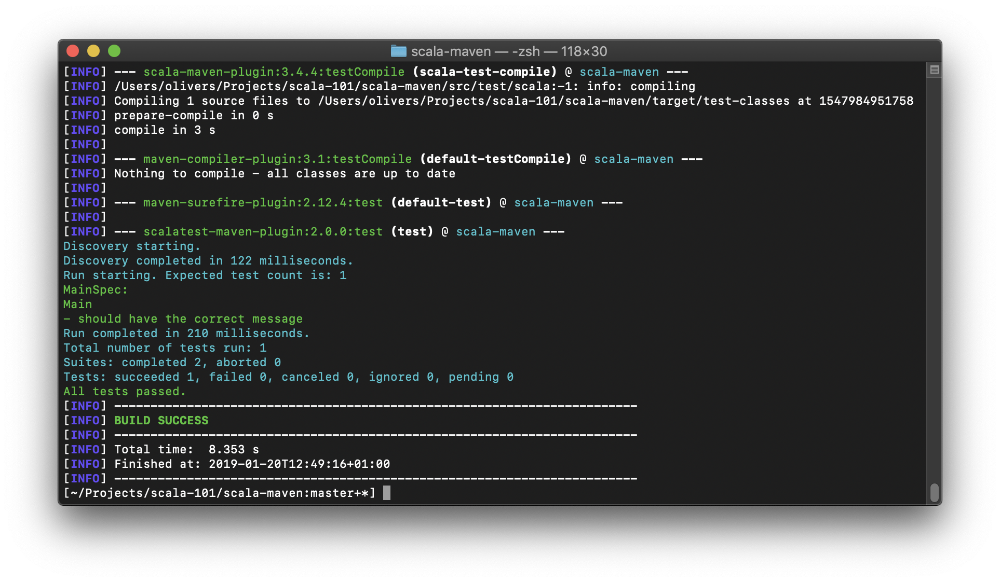
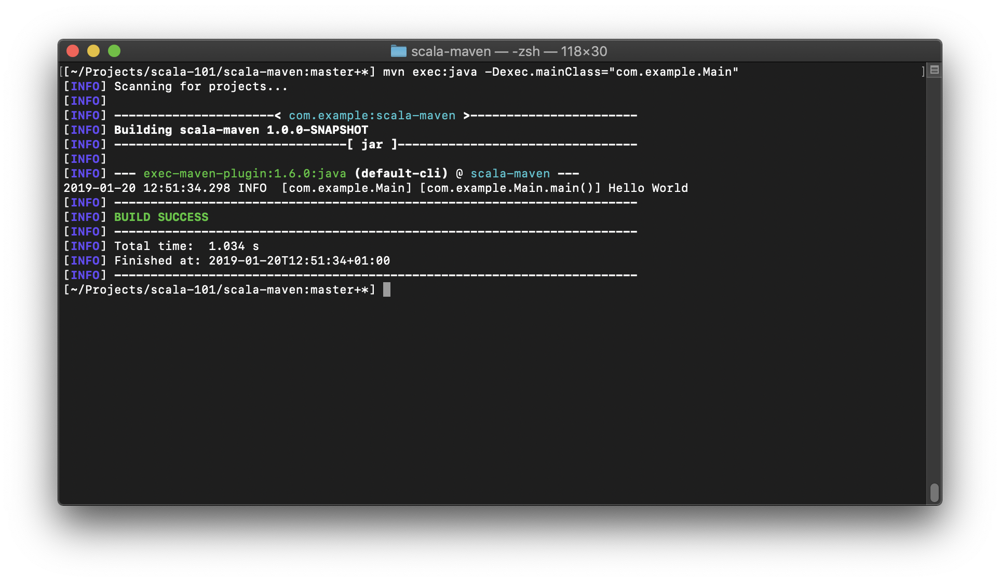
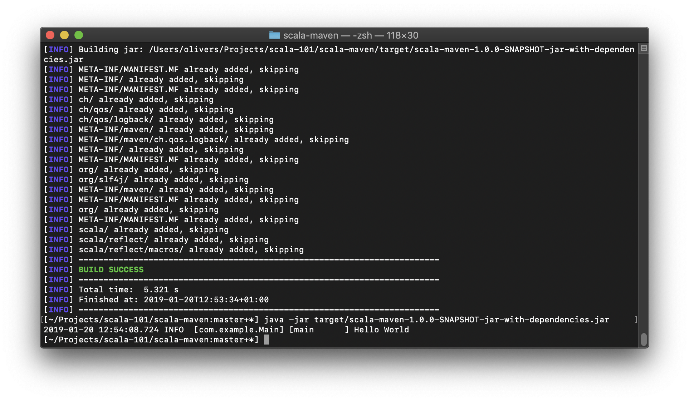

# scala-maven

Basic maven project to compile Scala code and create an executable jar.

Based on: <https://github.com/orrsella/scala-maven-template>

Includes:

- Scala/Maven project structure
- [ScalaTest](http://www.scalatest.org/) example
- Executable JAR
- Logging with [Logback](https://logback.qos.ch/)
-

Usage:

## Testing

```
mvn test
```



## Executing (with maven)

```
mvn exec:java -Dexec.mainClass="com.example.Main"
```



## Executing (jar)

```
mvn package
java -jar target/scala-maven-1.0.0-SNAPSHOT-jar-with-dependencies.jar
```


